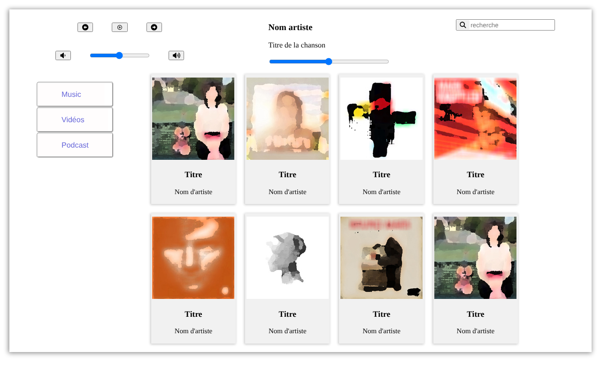
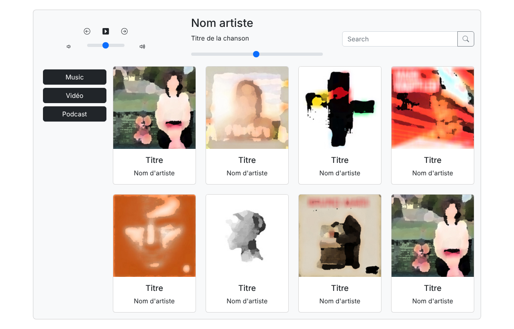
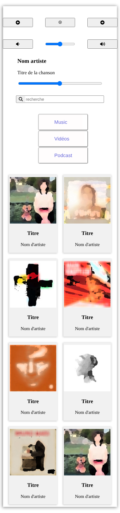

# 🎵 Lecteur de musique — CSS & Bootstrap

> Intégration d'une interface de lecteur de musique responsive, réalisée **deux fois** : une version en **CSS pur** et une version avec **Bootstrap 5**.


🌐 **Démo : [version CSS](https://aurored2-star.github.io/Lecteur-de-musique/) · [version Bootstrap](https://aurored2-star.github.io/Lecteur-de-musique/bootstrap.html)**

---

## 📖 À propos

Exercice d'intégration réalisé pendant ma formation de **Développeuse Web et Web Mobile (DWWM)**, à partir d'une maquette fournie (dossier `pochette artiste/`).
Faire la même interface avec deux approches m'a permis de comparer l'écriture du CSS « à la main » et l'utilisation d'un framework.

## 🖼️ Aperçus

**Version CSS pur** (`index.html`)



**Version Bootstrap** (`bootstrap.html`)



<p align="center">
  
</p>

## ✨ Contenu de l'interface

- Commandes de lecture (précédent, lecture, suivant) et réglage du volume
- Zone « morceau en cours » avec barre de progression
- Barre de recherche
- Menu Musique / Vidéos / Podcasts
- Grille de pochettes d'albums

## 🧠 Ce que j'ai travaillé

| Version CSS pur | Version Bootstrap |
|---|---|
| Mise en page avec Flexbox et Grid | Système de grille (`row`, `col-*`) |
| 4 feuilles de style par taille d'écran (media queries à 600, 768, 992 et 1200 px) | Classes responsives (`col-12 col-md-4`…) |
| Icônes Font Awesome | Icônes Bootstrap Icons |
| Ombres, bordures et espacements écrits à la main | Composants `card`, `btn`, `form-range` |

## 📁 Structure

```
├── index.html          # Version CSS pur
├── bootstrap.html      # Version Bootstrap
├── artiste*.css        # Styles de base + une feuille par breakpoint
├── 1.jpg … 7.jpg       # Pochettes affichées
├── captures/           # Captures d'écran du README
└── pochette artiste/   # Maquette et images fournies pour l'exercice
```

## 🚀 Lancer le projet

```bash
git clone https://github.com/aurored2-star/Lecteur-de-musique.git
```

Ouvrez `index.html` ou `bootstrap.html` dans votre navigateur, ou utilisez l'extension **Live Server** de VS Code.

## 👩‍💻 Autrice

**Aurore Dufour**, développeuse web & mobile en formation
[GitHub](https://github.com/aurored2-star)
